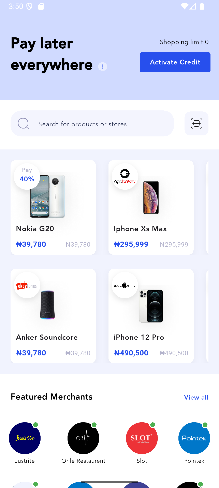
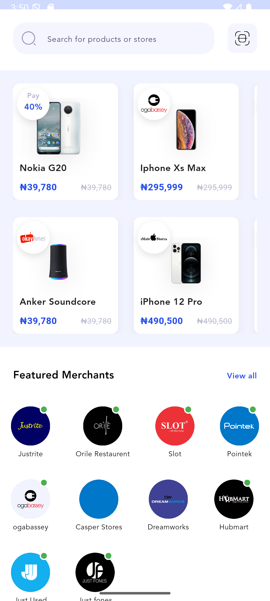

# Flutter Project


## Introduction

This is a Flutter project built using Dart to create a cross-platform mobile application. The project supports both iOS and Android platforms and follows the best practices for Flutter development.

## Features

- Cross-platform compatibility (iOS & Android)
- Responsive UI


## Screenshots

Here are some screenshots of the app:




## Getting Started

### Prerequisites

Make sure you have the following installed:

- [Flutter SDK](https://flutter.dev/docs/get-started/install)
- Dart
- Android Studio or Visual Studio Code (with Flutter plugin)
- Xcode (for iOS development)

### Installation

1. Clone the repository:
   ```sh
   git clone https://github.com/Adeyemi-olusola/credpal.git
   ```
2. Navigate to the project directory:
   ```sh
   cd flutter-project
   ```
3. Install dependencies:
   ```sh
   flutter pub get
   ```
4. Run the application:
   ```sh
   flutter run
   ```

## Folder Structure

```
flutter-project/
│── lib/
│   ├── app/
│   │   ├── textStyle.dart  # Text styles
│   │   ├── theme.dart      # Theme configuration
│   ├── core/
│   │   ├── features/
│   │   │   ├── shopping/
│   │   │   │   ├── model/   # Data models
│   │   │   │   ├── screen/  # UI screens
│   │   │   │   ├── widget/  # Reusable widgets
│   ├── shared/
│   │   ├── utils/  # Utility functions
│   │   ├── widget/ # Shared widgets
│   ├── main.dart  # Entry point of the application
│── assets/        # Images and other assets
│── pubspec.yaml   # Dependencies
│── README.md      # Project documentation
```

## Dependencies

This project uses the following dependencies:

```yaml
dependencies:
  flutter:
    sdk: flutter
  provider: ^6.0.0
  http: ^0.13.4
  shared_preferences: ^2.0.6
```

## Running Tests

To run unit tests, execute:

```sh
flutter test
```


## License

This project is licensed under the MIT License.

